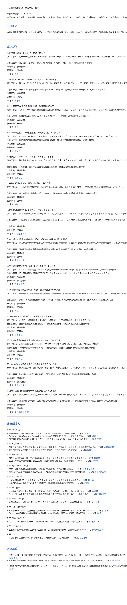

# More News Briefing

一次刷尽近期热点，高效工作一整天  
Scan the day in one pass, from headlines to chatter

中文入口: [跳转到中文说明](#中文说明)  
English entry: [Jump to English Overview](#english-overview)
Promo illustration pack: [View README promo illustration pack](./assets/readme-xiaohei-scenes/README.md)

## 项目表头

| 字段 | 内容 |
|---|---|
| 名称 | `more-news-briefing` |
| 版本 | `v0.1.4` |
| 类型 | AI Agent Skill / 新闻简报技能 |
| 场景 | 新闻简报 / 日报周报 / 研究跟踪 / 长消息汇总 |
| 关键词 | `news briefing`, `digest`, `AI`, `policy`, `business`, `WeChat`, `Feishu`, `新闻简报`, `日报`, `周报`, `研究跟踪` |

## 中文说明

`more-news-briefing` 是一个独立可运行的新闻/行业信息简报 skill，用于把分散的时事信息整理成结构稳定、可追溯来源、适合直接交付的多主题资讯摘要。它覆盖从需求归一化、候选信息收集、去重、排序，到最终格式化输出的完整链路，适合一次性简报，也适合持续性日报、周报和专题监测。

### 你为什么会愿意持续用它

很多“新闻摘要”工具解决的是“今天有什么”，但实际工作里更难的是下面几件事同时成立：

- 主题很多，但不能写成东拼西凑的链接堆
- 有专项跟踪需求，但又不想每次从零解释检索口径
- 需要能直接发给同事、老板、客户或群聊，而不是二次手工改写
- 希望高价值事件排在前面，弱证据条目自动降级到继续跟踪

`more-news-briefing` 的设计目标就是把这些高频痛点收束成一个稳定产品动作：先定合同，再出查询，再保留条目，最后按模板成稿。

### 适合谁

- 研究员/分析师：需要把 AI、政策、商业、产业专项放到同一份日报或周报里
- 创始人/投资人/管理者：想在几分钟内看完“今天最重要的三到十件事”
- 媒体、内容和运营团队：需要把素材快速整理成微信、飞书或内部播报可直接发送的格式
- 行业跟踪用户：例如充电桩、储能、V2G、快充、无线充电、超级电容等专题监测

### 安装（Agent 安装提示句）

把本仓库放入你的 AI Agent skills 目录（如 `~/.codex/skills/`），然后在对话中向大模型发送以下提示句即可激活：

> "使用 $more-news-briefing，按默认主题做一个今日新闻简报。"

首次激活后，技能会先给一个很短的入口：`直接开始 / 快速自定义 / 深度自定义`。如果你愿意先快速定一下主题、专项方向、地域和关注重点，后续结果会稳定很多；如果你只想马上看结果，也可以先按默认口径跑一版。

### 功能概览

- 信息来源更广：不是单一新闻源抓取，而是按“综合媒体 + 垂直媒体 + 官方/一手来源”三层混合取材，更适合做跨主题简报
- 更适合多主题合并：同一轮里可以同时覆盖 AI、政策、商业、文化、体育和用户专项主题，并在输出前统一去重、排序、压缩
- 对高价值信息更友好：当政策、公司公告、平台更新、监管变化这类事件出现时，会优先保留高影响条目，而不是被流量型热点挤掉
- 完全独立可用：这个 skill 自己就能走通“收集-筛选-验证-输出”链路，不依赖其它 skill、插件或外部编排
- 主流程完整内聚：检索扩展、候选合并、优先级排序、事实压缩和最终成稿都在同一套工作流里完成
- 更适合交付而不是试验：内置输入契约、输出模板、验收清单和运行 runbook，适合直接产出日报、周报、研究跟踪或微信/飞书长消息版简报

### 基于实现的功能亮点

- 首次使用更不容易被跳过自定义：入口先收口成 `直接开始 / 快速自定义 / 深度自定义` 三段式。想低摩擦开始可以直接跑，愿意个性化时再继续补主题、专项方向、地域和关注重点，减少第一次使用时“默认直接跑掉”的情况
- 默认主题开箱即用：如果用户只说“做个今日简报”，实现会自动落到 `AI与科技 / 政治与政策 / 商业与市场 / 文化与社会 / 体育` 这组预定义主题；一旦补充专项主题，会自动把“专项关注”并入同一份简报
- 专项监测更像行业 watch，而不是临时搜词：除了收集关键词，还支持 geography、priority 以及公司/机构/社区 watchlist，适合储能、充电桩、V2G、快充、无线充电、超级电容这类长期跟踪主题
- 简讯模板不是单一版式：仓库里已经预置 `Short Brief`、`Standard Digest`、`Analyst Watch`、`Source-attributed`、`WeChat / Feishu long message`、`信息密度高版`、`领导速览版` 等模板，能按阅读场景直接出稿
- 天然适合飞书/微信推送：现在默认要求最终成稿使用 Markdown 输出，并限制为适合聊天工具粘贴的轻量格式。长消息模板已经按聊天界面做了标题、段落密度、分主题速览和“继续跟踪”收口，既能做高信息密度版，也能做领导速览版，减少二次手工改写
- 可自定义后续推送与自动化：当任务包含持续投递时，skill 约定可以把最终稳定结构交给 `automation-workflows`，继续衔接定时发送、频道分发或重复执行，不需要每次重配整套流程
- 弱证据不会硬塞进正文：验证后可以把条目保留、降级或移到“继续跟踪”，这样正式简报和观察项天然分层，更适合研究汇报和团队同步

### 为什么是这个 Skill

很多资讯工具擅长“搜链接”，也有很多工具擅长“润色文案”，但真正难的是把多来源、跨主题、彼此重复的时事信息压缩成一个有排序、有判断、能直接发出去的简报。`more-news-briefing` 的价值就在这里。

它不是把搜索结果简单堆起来，也不是把已有材料机械改写，而是把“信息收集、去重、判断优先级、压缩表达、稳定交付”串成一条完整工作流，更适合长期做日报、周报和专题跟踪。

### 设计原则

- 先保证信息覆盖面，再追求措辞润色
- 先做优先级排序，再开始写摘要
- 先去重合并，再组织叙述
- 输出要能直接交付，而不是停留在研究笔记
- 工作流必须独立完整，不能依赖隐性外部能力
- 输出结构要稳定，方便重复执行和后续自动化

### 默认主题

当用户未指定主题时，默认覆盖以下内容：

1. AI 与科技
2. 政治与政策
3. 商业与市场
4. 文化与社会
5. 教育与体育
6. 用户重点关注的专项主题

### 工作模式

- `full mode`：默认模式，执行完整的收集、排序、验证和成稿流程
- `standard mode`：轻量模式，适合明确要求更快、更省步骤的场景
- `minimal mode`：在检索受限时，优先重组用户已提供材料

### 首次使用交互

第一次使用时，skill 不再一上来就丢一个完整问卷，而是先给一个很短的三选一入口：

1. `直接开始`：先按默认主题跑一版
2. `快速自定义`：优先确认主题、专项方向、地域、关注重点
3. `深度自定义`：进一步补信息源风格和观察名单

如果用户进入自定义分支，尤其当用户提到“专项主题”但定义仍然偏宽泛时，会优先补全这些信息：

1. 专项主题名称
2. 关注范围，例如技术、政策、企业、项目或市场切片
3. 中英文关键词、缩写、别名
4. 地域范围
5. 重点关注维度，例如政策、产品、安全、招投标、融资或研究
6. 希望排除的相邻主题

### 工作流

1. 使用输入契约归一化用户请求
2. 按主题桶收集候选新闻
3. 对重复事件做合并，并按重要性排序
4. 生成包含概览、重点条目和可选跟踪项的简报
5. 输出为可复用、可继续自动化的稳定格式

### 为什么它更像“可交付产品”而不是“摘要提示词”

从仓库当前实现来看，主流程已经被收拢成一个很清晰的闭环：

- 同一个 `Contract` 结构同时驱动合同归一化、查询生成和最终成稿
- `digest` 会自动区分“正式保留条目”和“继续跟踪条目”，避免把弱证据内容硬塞进正文
- 输出样式不是单一模板，而是面向不同投递场景准备了 `Quick Brief`、`Standard Digest`、`Analyst Watch`、`Long Message Briefing` 和执行层速览
- 外部增强器是可选项，不是隐性依赖，所以它既适合个人临时使用，也适合后续接入自动化

这意味着你不是在买一段 prompt，而是在拿到一个已经有边界、有默认值、有输出约束的 briefing workflow。

### 输出形式

- `Quick Brief`：适合手机快速浏览的短简报
- `Standard Digest`：适合日报/周报的标准摘要
- `Analyst Watch`：适合研究型监测的分析视图
- `Long Message Briefing`：适合微信或飞书长消息投递

当前默认交付格式：

- 最终答案默认使用 `Markdown`
- 优先使用标题、编号列表、平铺项目符号
- 不依赖 HTML、复杂表格或容易在飞书里粘贴失真的格式

### 典型用法

- “做个今日新闻简报”
- “按 AI、政策、商业三个主题做周报”
- “帮我整理成适合微信发送的长消息版资讯汇总”
- “把我给你的素材整理成带来源的简报”

## 版本说明

### v0.1.4

- 新增 `references/borrowed-source-catalog.md`，将新闻来源整理为可直接选用的网站、Feed、API、社区和观察名单目录
- 补充网易、澎湃、中国日报、搜狐、腾讯新闻、腾讯体育、新浪国际、IT之家等国内媒体及细频道的适用主题、来源角色和验证要求
- 纳入 Google News RSS、GDELT、Hacker News、GitHub、RSS、Reddit、Telegram、OSS Insight、OpenBB 与 X 等开放或可选来源，并标注访问条件
- 新增中国综合、AI 科技、国际事务、商业市场、文化社会和体育的默认选源组合，以及逐来源 fallback 和统一来源元数据字段
- 加固本地 runner 的完整执行链，明确 `收集 → 归一化/去重 → 排序/保留 → 验证 → 渲染 → 验收 → 润色` 七阶段产物合同
- 新增稳定 `item_id`、规范 URL 与唯一标题三级验证匹配，未知验证结论和缺失证据条目会失败关闭或进入继续跟踪
- 新增 `prepare`、机器可读验收报告、确定性去重排序，以及由专项范围、排除项和观察名单生成的查询与来源目标
- 所有可执行命令改为参数数组，字符串命令仅用于展示；vendored adapter 只有在入口、凭证和许可证均通过检查时才会自动路由
- 最终简报默认保存为 UTF-8 的 `daily-news-YYYY-MM-DD.md`，并支持调用方指定输出路径

### v0.1.3

- 默认把最终成稿格式收口为 `Markdown`，更适合飞书、微信等聊天场景直接粘贴发送
- 同步调整输出模板示例，让 `Short Brief`、`Standard Digest`、`Analyst Watch` 和长消息模板都以 Markdown 结构展示
- 优化首次使用入口，不再默认让用户在第一次调用时悄悄跳过自定义
- 新增 `直接开始 / 快速自定义 / 深度自定义` 三段式首轮分流，既保留低摩擦首跑，也让个性化配置更显式
- 明确首次按默认口径执行时，需要在输出中显式声明默认假设，并提醒用户下次可走快速自定义

### v0.1.2

- 强化 `standalone-first` 设计，明确外部 skill 仅为可选增强器
- 新增 `scripts/standalone_runner.py`，内置合同归一化、查询生成和 digest 成稿
- 新增 `references/local-runner.md`，说明本地 runner 的使用方式
- 调整检索说明，默认主路回到 skill 自带流程

### v0.1.1

- 新增 `SKILL.md` 与 `agents/openai.yaml` 版本号
- 新增中英双语 `README.md`
- 新增 GitHub 风格徽章、关键词索引、快速导航与跳转链接
- 新增标准 MIT `LICENSE`

---

## English Overview

中文链接: [跳转到中文说明](#中文说明)

`more-news-briefing` is a standalone news-briefing skill built to turn scattered current-affairs information into structured, source-backed, delivery-ready digests. It covers the full path from request normalization and candidate collection to deduplication, prioritization, and final formatting, making it suitable for one-off summaries as well as recurring daily, weekly, or topic-watch briefings.

### Why People Keep Coming Back To It

Most news-summary tools answer "what happened today." Real work usually needs more:

- multiple topics without turning the output into a link dump
- stable specialty monitoring without redefining the search scope every time
- delivery-ready output for chat, leadership updates, or internal distribution
- automatic downgrading of weakly sourced items into a watchlist instead of overstating them

`more-news-briefing` is built around that practical loop: resolve the contract, generate topic-bucket queries, retain the right items, then render a digest that can actually be sent.

### Who It Is For

- researchers and analysts merging AI, policy, business, and specialty monitoring into one briefing
- founders, investors, and managers who want the top three to ten meaningful developments fast
- editorial, content, and ops teams preparing WeChat, Feishu, or internal distribution-ready updates
- domain watchers tracking areas like charging, BESS, V2G, fast charging, wireless charging, or supercapacitors

### Installation (Agent Activation Prompts)

Place this repository into your AI Agent skills directory (e.g., `~/.codex/skills/`), then activate it by telling your agent:

> "Use $more-news-briefing. Make a news digest with default topics in full mode."

On first use, the skill now starts with a very short gate: `direct default run / quick customization / deep customization`. If you want lower friction, you can run once with defaults; if you want better fit, you can quickly lock in topic mix, specialty direction, geography, and watch priorities first.

### What It Does

- Broader source coverage: it uses a blended source model of general outlets, vertical publications, and official or primary sources instead of relying on a single feed
- Stronger multi-topic synthesis: it can merge AI, policy, business, culture, sports, and user-priority specialty topics into one ranked digest
- Better handling of high-impact signals: policy shifts, company announcements, platform updates, and regulatory moves are intended to outrank low-value noise
- Fully self-contained: it completes the collect-filter-verify-format loop on its own, without relying on companion skills, plugins, or external orchestration
- Tighter workflow ownership: search expansion, candidate merging, prioritization, factual compression, and final briefing output all live inside one cohesive workflow
- Built for delivery, not just exploration: it includes an input contract, output templates, acceptance checks, and runbooks so the result is ready for reporting or chat-based delivery

### Implementation-Backed Highlights

- First-use setup is less likely to skip customization by accident: the onboarding flow now starts with a compact three-path gate for direct default run, quick customization, or deep customization before expanding into the full topic form
- Default topics work out of the box: if the user simply asks for a digest, the implementation falls back to a predefined mix of `AI and technology`, `politics and policy`, `business and markets`, `culture and society`, and `sports`; a specialty topic is then appended into the same briefing when needed
- Specialty monitoring behaves more like an industry watchlist than a one-off search: the contract supports specialty keywords, geography, priority lenses, and company / institution / community watchlists for repeatable tracking
- Output is template-rich, not one-size-fits-all: the repository already includes `Short Brief`, `Standard Digest`, `Analyst Watch`, source-attributed formats, WeChat / Feishu long-message layouts, a high-density variant, and an executive-skim variant
- Chat delivery is a first-class scenario: final output now defaults to Markdown, using lightweight structure that pastes cleanly into WeChat and Feishu while keeping the long-message layouts readable
- Ongoing push workflows can be customized: when the job includes repeated delivery, the skill is designed to hand off its stable digest structure to `automation-workflows` for scheduling and downstream channel delivery
- Weak evidence is handled visibly: verification can keep, downgrade, or move items into a follow-up watch section so the main digest stays cleaner for actual reporting

### Why This Skill

Many news tools are good at collecting links, and many writing tools are good at polishing prose. The harder job is turning overlapping, cross-topic, multi-source current-affairs input into a ranked, readable briefing that can actually be delivered. That is the core value of `more-news-briefing`.

It is not a raw search-result dump, and it is not a mechanical rewrite layer. It is a complete workflow that connects collection, deduplication, prioritization, compression, and stable delivery into one reusable briefing system.

### Design Principles

- Source breadth before summary polish
- Ranking before writing
- Deduplication before narration
- Delivery-ready structure over raw research notes
- Standalone workflow over hidden dependencies
- Stable output shape for repeated use

### Default Topic Mix

If the user does not specify topics, the skill defaults to:

1. AI and technology
2. Politics and policy
3. Business and markets
4. Culture and society
5. Sports
6. User-priority specialty topics

### Operating Modes

- `full mode`: default mode; runs the complete collect-rank-verify-write workflow
- `standard mode`: lighter mode for explicitly faster or simpler runs
- `minimal mode`: restructures user-provided material when retrieval is constrained

### First-Use Interaction

On the first use, the skill should not drop the user straight into a heavy form. It should start with a compact three-path choice:

1. direct default run
2. quick customization
3. deep customization

If the user chooses customization, and a specialty topic is still vague, it should help the user refine:

1. topic name
2. scope
3. Chinese and English keywords or aliases
4. geography
5. watch priorities such as policy, product, safety, financing, or bids
6. exclusions

### Workflow

1. Normalize the request with the input contract
2. Collect candidate stories across topic buckets
3. Deduplicate and rank by consequence, recency, attention, relevance, and novelty
4. Write a layered digest with summary, ranked items, and optional watchlist
5. Prepare the result in a stable format for repeated use

### Why This Feels Like A Product, Not A Prompt

The current implementation already concentrates the workflow into a durable core:

- the same `Contract` structure drives normalization, query generation, and digest rendering
- weakly sourced or unresolved items are separated from the main body instead of being overstated
- output is shaped for multiple delivery contexts, from quick skim to analyst watch to chat-ready long message
- external enhancers stay optional, which keeps the workflow portable and easier to automate later

That makes this repository more useful than a one-off summarization prompt. It gives you a bounded, repeatable briefing system.

### Output Styles

- `Quick Brief`: short mobile-friendly summary
- `Standard Digest`: balanced daily or weekly roundup
- `Analyst Watch`: research-heavy monitoring format
- `Long Message Briefing`: chat-friendly format for WeChat or Feishu

Default delivery format:

- final answers are rendered in `Markdown`
- headings, numbered lists, and flat bullets are preferred
- complex HTML-style formatting should be avoided for chat delivery

## Release Notes

### v0.1.4

- Added `references/borrowed-source-catalog.md`, turning the inventories into a concrete catalog of sites, feeds, APIs, communities, and watchlists
- Documented Chinese media and channel coverage for NetEase, The Paper, China Daily, Sohu, Tencent News, Tencent Sports, Sina International, and IT Home, including source roles and verification requirements
- Added Google News RSS, GDELT, Hacker News, GitHub, RSS, Reddit, Telegram, OSS Insight, OpenBB, and X with access requirements and evidence boundaries
- Added default source packs for China, AI and technology, global affairs, business and markets, culture and society, and sports, plus per-source fallbacks and normalized source metadata
- Hardened the local runner around a seven-phase artifact contract: `collect → normalize/deduplicate → rank/retain → verify → render → acceptance → polish`
- Added stable item IDs plus canonical-URL and unique-title verification matching; unknown verdicts and incomplete evidence now fail closed or move to follow-up
- Added `prepare`, machine-readable acceptance reports, deterministic deduplication and ranking, and watchlist-driven queries with concrete source targets
- Replaced executable command strings with argv arrays; vendored adapters route only when entrypoints, credentials, and distribution licenses pass health checks
- Defaulted final UTF-8 Markdown artifacts to `daily-news-YYYY-MM-DD.md` while preserving explicit output paths

### v0.1.3

- Defaulted final delivery to `Markdown` for cleaner WeChat and Feishu paste behavior
- Updated the reusable output templates so the briefing examples themselves follow Markdown structure
- Tightened first-use onboarding so customization is not silently skipped on direct first invocation
- Added a three-path first-use gate: direct default run, quick customization, and deep customization
- Required first-use default runs to label assumptions explicitly and remind the user that quick customization is available

### v0.1.2

- Clarified the `standalone-first` design so companion skills are optional only
- Added `scripts/standalone_runner.py` for contract resolution, query planning, and digest rendering
- Added `references/local-runner.md` for local runner usage
- Repositioned retrieval guidance so the built-in workflow remains the default route

### v0.1.1

- Added version metadata to `SKILL.md` and `agents/openai.yaml`
- Added a bilingual `README.md`
- Added GitHub-style badges, keyword indexing, quick navigation, and anchor links
- Added a standard MIT `LICENSE`
